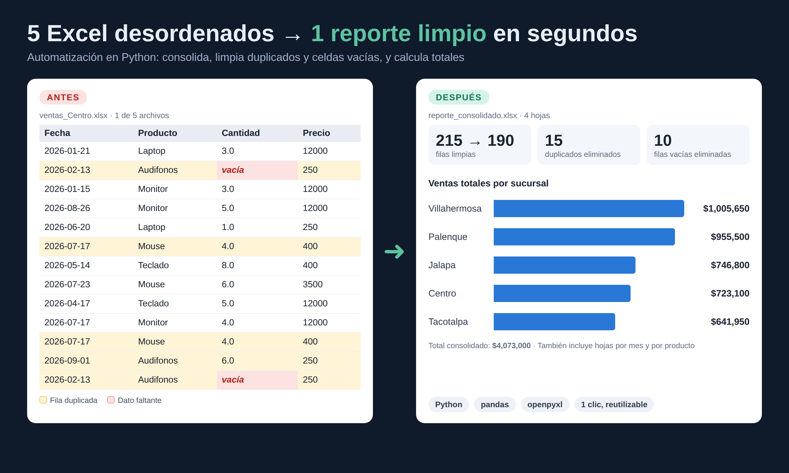

# Consolidador de Excel con Python

¿Tienes un montón de archivos de Excel que cada mes tienes que juntar a mano? Este script lo hace por ti en un segundo.



## ¿Por qué lo hice?

Imagina un negocio con 5 sucursales. Cada una manda su Excel de ventas y alguien tiene que abrirlos uno por uno, copiar y pegar todo en una sola hoja, buscar las filas repetidas, arreglar las celdas vacías y luego armar los totales. Eso se lleva fácil una o dos horas, y basta un mal copiar y pegar para que los números salgan mal.

Quise automatizar justo ese tipo de tarea: aburrida, repetitiva y en la que es muy fácil equivocarse.

## ¿Qué hace?

Metes tus archivos en la carpeta `entrada/`, corres el script y listo. Por dentro hace esto:

- Lee todos los Excel y anota de qué sucursal viene cada venta.
- Quita las filas duplicadas y las que no tienen cantidad.
- Calcula el total de cada venta.
- Te deja un reporte en `salida/reporte_consolidado.xlsx` con cuatro hojas: los datos limpios, las ventas por sucursal, por mes y por producto.

Además, al terminar te dice en la terminal cuánto limpió, para que sepas exactamente qué pasó con tus datos.

## Los resultados

Lo probé con 5 archivos de ventas de ejemplo que tenían errores a propósito:

- Entraron **215 filas** y salieron **190 limpias**.
- Encontró y quitó **15 duplicados** y **10 filas incompletas**.
- Sumó **$4,073,000** en ventas entre las cinco sucursales.
- Todo en **alrededor de un segundo**.

| Sucursal | Ventas totales |
|---|---|
| Villahermosa | $1,005,650 |
| Palenque | $955,500 |
| Jalapa | $746,800 |
| Centro | $723,100 |
| Tacotalpa | $641,950 |

## ¿Cómo lo uso?

Solo necesitas tener Python instalado.

```bash
# Crea y activa un entorno virtual
python -m venv .venv
.venv\Scripts\activate        # en Windows
# source .venv/bin/activate   # en Linux o macOS

# Instala lo necesario
python -m pip install -r requirements.txt

# Si quieres probarlo con datos de ejemplo
python generar_datos.py

# Pon tus Excel en entrada/ y ejecuta
python consolidar.py
```

Tu reporte aparecerá en la carpeta `salida/`.

## ¿Cómo está organizado?

```
consolidador-excel/
├── entrada/            # aquí van los Excel de cada sucursal
├── salida/             # aquí aparece el reporte
├── capturas/           # imágenes de este README
├── generar_datos.py    # crea datos de prueba con errores
├── consolidar.py       # el script principal
└── requirements.txt
```

Está hecho con **Python**, **pandas** para limpiar y agrupar los datos, y **openpyxl** para crear el Excel.

## ¿Te sirve para otra cosa?

Seguramente sí. La misma idea funciona para facturas, inventarios, listas de asistencia, encuestas o cualquier grupo de hojas de cálculo que tengan el mismo formato. Si tienes un caso parecido, se puede adaptar a lo que necesites.

*Los datos de este proyecto son inventados, solo para la demostración.*
